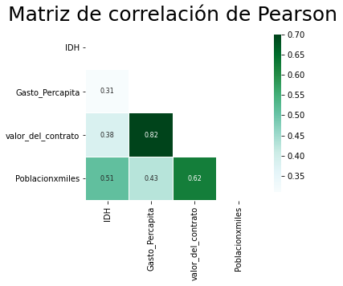

El presente Jupyter Pretende unificar las bases correspondientes al IHD, la Población y SECOP. Obtenidos en Jupyter's anteriores, esto con el fin de unificar estos archivos y generar una sola base.


```python
import requests
from bs4 import BeautifulSoup
from selenium import webdriver
import re
import time
import pandas as pd
import numpy as np
import matplotlib.pyplot as plt
```


```python
# Se llama la base de SECOP

BaseSECOP = pd.read_csv('/Users/hernangracia/Desktop/Python/Proyecto_Gasto_IDH/Base_Secop.csv')
BaseSECOP
```


<div>
<style scoped>
    .dataframe tbody tr th:only-of-type {
        vertical-align: middle;
    }

    .dataframe tbody tr th {
        vertical-align: top;
    }

    .dataframe thead th {
        text-align: right;
    }
</style>
<table border="1" class="dataframe">
  <thead>
    <tr style="text-align: right;">
      <th></th>
      <th>departamento</th>
      <th>anno_bpin</th>
      <th>valor_del_contrato</th>
    </tr>
  </thead>
  <tbody>
    <tr>
      <th>0</th>
      <td>Antioquia</td>
      <td>2016</td>
      <td>5919507572</td>
    </tr>
    <tr>
      <th>1</th>
      <td>Antioquia</td>
      <td>2017</td>
      <td>453890900</td>
    </tr>
    <tr>
      <th>2</th>
      <td>Antioquia</td>
      <td>2018</td>
      <td>1337222957986</td>
    </tr>
    <tr>
      <th>3</th>
      <td>Antioquia</td>
      <td>2019</td>
      <td>1690246491592</td>
    </tr>
    <tr>
      <th>4</th>
      <td>Arauca</td>
      <td>2018</td>
      <td>32633333</td>
    </tr>
    <tr>
      <th>...</th>
      <td>...</td>
      <td>...</td>
      <td>...</td>
    </tr>
    <tr>
      <th>69</th>
      <td>Valle del Cauca</td>
      <td>2018</td>
      <td>77340806810</td>
    </tr>
    <tr>
      <th>70</th>
      <td>Valle del Cauca</td>
      <td>2019</td>
      <td>263618330375</td>
    </tr>
    <tr>
      <th>71</th>
      <td>Vichada</td>
      <td>2017</td>
      <td>702500000</td>
    </tr>
    <tr>
      <th>72</th>
      <td>Vichada</td>
      <td>2018</td>
      <td>10519894140</td>
    </tr>
    <tr>
      <th>73</th>
      <td>Vichada</td>
      <td>2019</td>
      <td>3638121493</td>
    </tr>
  </tbody>
</table>
<p>74 rows × 3 columns</p>
</div>


```python
#Se llama la base de IDH
BaseIDH = pd.read_csv('/Users/hernangracia/Desktop/Python/Proyecto_Gasto_IDH/Base_IDH.csv')
BaseIDH
```


<div>
<style scoped>
    .dataframe tbody tr th:only-of-type {
        vertical-align: middle;
    }

    .dataframe tbody tr th {
        vertical-align: top;
    }

    .dataframe thead th {
        text-align: right;
    }
</style>
<table border="1" class="dataframe">
  <thead>
    <tr style="text-align: right;">
      <th></th>
      <th>departamento</th>
      <th>IDH</th>
      <th>año</th>
    </tr>
  </thead>
  <tbody>
    <tr>
      <th>0</th>
      <td>Amazonas</td>
      <td>0.710</td>
      <td>2016</td>
    </tr>
    <tr>
      <th>1</th>
      <td>Antioquia (incl Medellin)</td>
      <td>0.765</td>
      <td>2016</td>
    </tr>
    <tr>
      <th>2</th>
      <td>Arauca</td>
      <td>0.734</td>
      <td>2016</td>
    </tr>
    <tr>
      <th>3</th>
      <td>Atlantico (incl Barranquilla)</td>
      <td>0.779</td>
      <td>2016</td>
    </tr>
    <tr>
      <th>4</th>
      <td>Bogota D.C.</td>
      <td>0.806</td>
      <td>2016</td>
    </tr>
    <tr>
      <th>...</th>
      <td>...</td>
      <td>...</td>
      <td>...</td>
    </tr>
    <tr>
      <th>127</th>
      <td>Sucre</td>
      <td>0.744</td>
      <td>2019</td>
    </tr>
    <tr>
      <th>128</th>
      <td>Tolima</td>
      <td>0.747</td>
      <td>2019</td>
    </tr>
    <tr>
      <th>129</th>
      <td>Valle (incl Cali)</td>
      <td>0.791</td>
      <td>2019</td>
    </tr>
    <tr>
      <th>130</th>
      <td>Vaupis</td>
      <td>0.639</td>
      <td>2019</td>
    </tr>
    <tr>
      <th>131</th>
      <td>Vichada</td>
      <td>0.754</td>
      <td>2019</td>
    </tr>
  </tbody>
</table>
<p>132 rows × 3 columns</p>
</div>


```python
#Se llama la base de Poblacion
BasePoblacionTotal = pd.read_csv('/Users/hernangracia/Desktop/Python/Proyecto_Gasto_IDH/Base_Poblacion.csv')
BasePoblacionTotal

```


<div>
<style scoped>
    .dataframe tbody tr th:only-of-type {
        vertical-align: middle;
    }

    .dataframe tbody tr th {
        vertical-align: top;
    }

    .dataframe thead th {
        text-align: right;
    }
</style>
<table border="1" class="dataframe">
  <thead>
    <tr style="text-align: right;">
      <th></th>
      <th>departamento</th>
      <th>Poblacion</th>
      <th>año</th>
    </tr>
  </thead>
  <tbody>
    <tr>
      <th>0</th>
      <td>Amazonas</td>
      <td>76.1</td>
      <td>2016</td>
    </tr>
    <tr>
      <th>1</th>
      <td>Antioquia (incl Medellin)</td>
      <td>6464.0</td>
      <td>2016</td>
    </tr>
    <tr>
      <th>2</th>
      <td>Arauca</td>
      <td>263.0</td>
      <td>2016</td>
    </tr>
    <tr>
      <th>3</th>
      <td>Atlantico (incl Barranquilla)</td>
      <td>2463.0</td>
      <td>2016</td>
    </tr>
    <tr>
      <th>4</th>
      <td>Bogota D.C.</td>
      <td>7888.0</td>
      <td>2016</td>
    </tr>
    <tr>
      <th>...</th>
      <td>...</td>
      <td>...</td>
      <td>...</td>
    </tr>
    <tr>
      <th>127</th>
      <td>Sucre</td>
      <td>891.0</td>
      <td>2019</td>
    </tr>
    <tr>
      <th>128</th>
      <td>Tolima</td>
      <td>1473.0</td>
      <td>2019</td>
    </tr>
    <tr>
      <th>129</th>
      <td>Valle (incl Cali)</td>
      <td>4827.0</td>
      <td>2019</td>
    </tr>
    <tr>
      <th>130</th>
      <td>Vaupis</td>
      <td>45.8</td>
      <td>2019</td>
    </tr>
    <tr>
      <th>131</th>
      <td>Vichada</td>
      <td>32.7</td>
      <td>2019</td>
    </tr>
  </tbody>
</table>
<p>132 rows × 3 columns</p>
</div>


## ANALISIS DE DATOS


```python
#Analisis de la base de Poblacion

#Se deja la variable "Region" como indice y se cambian algunos datos por n
BasePoblacionTotal.set_index("departamento", inplace=True)
BasePoblacionTotal.rename(index={'Vaupis':'Vaupes','Antioquia (incl Medellin)':'Antioquia','Atlantico (incl Barranquilla)':'Atlantico','Bolivar (Sur and Norte)':'Bolivar','Guainja':'Guainia','Valle (incl Cali)':'Valle del Cauca'},inplace=True)
#Asignacion de una nueva variable
BasePoblacionTotal=BasePoblacionTotal.assign(Poblacionxmiles=0)
BasePoblacionTotal['Poblacionxmiles']=(BasePoblacionTotal['Poblacion']*1000)
BasePoblacionTotal

```


<div>
<style scoped>
    .dataframe tbody tr th:only-of-type {
        vertical-align: middle;
    }

    .dataframe tbody tr th {
        vertical-align: top;
    }

    .dataframe thead th {
        text-align: right;
    }
</style>
<table border="1" class="dataframe">
  <thead>
    <tr style="text-align: right;">
      <th></th>
      <th>Poblacion</th>
      <th>año</th>
      <th>Poblacionxmiles</th>
    </tr>
    <tr>
      <th>departamento</th>
      <th></th>
      <th></th>
      <th></th>
    </tr>
  </thead>
  <tbody>
    <tr>
      <th>Amazonas</th>
      <td>76.1</td>
      <td>2016</td>
      <td>76100.0</td>
    </tr>
    <tr>
      <th>Antioquia</th>
      <td>6464.0</td>
      <td>2016</td>
      <td>6464000.0</td>
    </tr>
    <tr>
      <th>Arauca</th>
      <td>263.0</td>
      <td>2016</td>
      <td>263000.0</td>
    </tr>
    <tr>
      <th>Atlantico</th>
      <td>2463.0</td>
      <td>2016</td>
      <td>2463000.0</td>
    </tr>
    <tr>
      <th>Bogota D.C.</th>
      <td>7888.0</td>
      <td>2016</td>
      <td>7888000.0</td>
    </tr>
    <tr>
      <th>...</th>
      <td>...</td>
      <td>...</td>
      <td>...</td>
    </tr>
    <tr>
      <th>Sucre</th>
      <td>891.0</td>
      <td>2019</td>
      <td>891000.0</td>
    </tr>
    <tr>
      <th>Tolima</th>
      <td>1473.0</td>
      <td>2019</td>
      <td>1473000.0</td>
    </tr>
    <tr>
      <th>Valle del Cauca</th>
      <td>4827.0</td>
      <td>2019</td>
      <td>4827000.0</td>
    </tr>
    <tr>
      <th>Vaupes</th>
      <td>45.8</td>
      <td>2019</td>
      <td>45800.0</td>
    </tr>
    <tr>
      <th>Vichada</th>
      <td>32.7</td>
      <td>2019</td>
      <td>32700.0</td>
    </tr>
  </tbody>
</table>
<p>132 rows × 3 columns</p>
</div>


```python
#Analisis de la base IDH

#Se deja la variable "Region" como indice y se cambian algunos datos de esta variable para unificar terminos
BaseIDH.set_index("departamento", inplace=True)
BaseIDH.rename(index={'Vaupis':'Vaupes','Antioquia (incl Medellin)':'Antioquia','Atlantico (incl Barranquilla)':'Atlantico','Bolivar (Sur and Norte)':'Bolivar','Guainja':'Guainia','Valle (incl Cali)':'Valle del Cauca'},inplace=True)
BaseIDH
```


<div>
<style scoped>
    .dataframe tbody tr th:only-of-type {
        vertical-align: middle;
    }

    .dataframe tbody tr th {
        vertical-align: top;
    }

    .dataframe thead th {
        text-align: right;
    }
</style>
<table border="1" class="dataframe">
  <thead>
    <tr style="text-align: right;">
      <th></th>
      <th>IDH</th>
      <th>año</th>
    </tr>
    <tr>
      <th>departamento</th>
      <th></th>
      <th></th>
    </tr>
  </thead>
  <tbody>
    <tr>
      <th>Amazonas</th>
      <td>0.710</td>
      <td>2016</td>
    </tr>
    <tr>
      <th>Antioquia</th>
      <td>0.765</td>
      <td>2016</td>
    </tr>
    <tr>
      <th>Arauca</th>
      <td>0.734</td>
      <td>2016</td>
    </tr>
    <tr>
      <th>Atlantico</th>
      <td>0.779</td>
      <td>2016</td>
    </tr>
    <tr>
      <th>Bogota D.C.</th>
      <td>0.806</td>
      <td>2016</td>
    </tr>
    <tr>
      <th>...</th>
      <td>...</td>
      <td>...</td>
    </tr>
    <tr>
      <th>Sucre</th>
      <td>0.744</td>
      <td>2019</td>
    </tr>
    <tr>
      <th>Tolima</th>
      <td>0.747</td>
      <td>2019</td>
    </tr>
    <tr>
      <th>Valle del Cauca</th>
      <td>0.791</td>
      <td>2019</td>
    </tr>
    <tr>
      <th>Vaupes</th>
      <td>0.639</td>
      <td>2019</td>
    </tr>
    <tr>
      <th>Vichada</th>
      <td>0.754</td>
      <td>2019</td>
    </tr>
  </tbody>
</table>
<p>132 rows × 2 columns</p>
</div>


```python
#Analisis de la base SECOP

BaseSECOP.set_index("departamento", inplace=True)
BaseSECOP.rename(index={'Atlántico':'Atlantico','Bolívar':'Bolivar','Boyacá':'Boyaca','Caquetá':'Caqueta','Chocó':'Choco','Córdoba':'Cordoba','Distrito Capital de Bogotá':'Bogota D.C.','La Guajira':'Guajira','Nariño':'Narino','Quindío':'Quindio','San Andrés, Providencia y Santa Catalina':'San Andres'},inplace=True)
BaseSECOP.rename(columns={'anno_bpin':'año'},inplace=True)
BaseSECOP

```


<div>
<style scoped>
    .dataframe tbody tr th:only-of-type {
        vertical-align: middle;
    }

    .dataframe tbody tr th {
        vertical-align: top;
    }

    .dataframe thead th {
        text-align: right;
    }
</style>
<table border="1" class="dataframe">
  <thead>
    <tr style="text-align: right;">
      <th></th>
      <th>año</th>
      <th>valor_del_contrato</th>
    </tr>
    <tr>
      <th>departamento</th>
      <th></th>
      <th></th>
    </tr>
  </thead>
  <tbody>
    <tr>
      <th>Antioquia</th>
      <td>2016</td>
      <td>5919507572</td>
    </tr>
    <tr>
      <th>Antioquia</th>
      <td>2017</td>
      <td>453890900</td>
    </tr>
    <tr>
      <th>Antioquia</th>
      <td>2018</td>
      <td>1337222957986</td>
    </tr>
    <tr>
      <th>Antioquia</th>
      <td>2019</td>
      <td>1690246491592</td>
    </tr>
    <tr>
      <th>Arauca</th>
      <td>2018</td>
      <td>32633333</td>
    </tr>
    <tr>
      <th>...</th>
      <td>...</td>
      <td>...</td>
    </tr>
    <tr>
      <th>Valle del Cauca</th>
      <td>2018</td>
      <td>77340806810</td>
    </tr>
    <tr>
      <th>Valle del Cauca</th>
      <td>2019</td>
      <td>263618330375</td>
    </tr>
    <tr>
      <th>Vichada</th>
      <td>2017</td>
      <td>702500000</td>
    </tr>
    <tr>
      <th>Vichada</th>
      <td>2018</td>
      <td>10519894140</td>
    </tr>
    <tr>
      <th>Vichada</th>
      <td>2019</td>
      <td>3638121493</td>
    </tr>
  </tbody>
</table>
<p>74 rows × 2 columns</p>
</div>


```python
#Unificacion de bases
Base_Unificada = pd.merge(BasePoblacionTotal,BaseIDH,how='inner', left_on=['departamento','año'], right_on=['departamento','año']).merge(BaseSECOP,how='inner', left_on=['departamento','año'], right_on=['departamento','año'])
Base_Unificada

```


<div>
<style scoped>
    .dataframe tbody tr th:only-of-type {
        vertical-align: middle;
    }

    .dataframe tbody tr th {
        vertical-align: top;
    }

    .dataframe thead th {
        text-align: right;
    }
</style>
<table border="1" class="dataframe">
  <thead>
    <tr style="text-align: right;">
      <th></th>
      <th>Poblacion</th>
      <th>año</th>
      <th>Poblacionxmiles</th>
      <th>IDH</th>
      <th>valor_del_contrato</th>
    </tr>
    <tr>
      <th>departamento</th>
      <th></th>
      <th></th>
      <th></th>
      <th></th>
      <th></th>
    </tr>
  </thead>
  <tbody>
    <tr>
      <th>Antioquia</th>
      <td>6464.0</td>
      <td>2016</td>
      <td>6464000.0</td>
      <td>0.765</td>
      <td>5919507572</td>
    </tr>
    <tr>
      <th>Santander</th>
      <td>2063.0</td>
      <td>2016</td>
      <td>2063000.0</td>
      <td>0.771</td>
      <td>21000000</td>
    </tr>
    <tr>
      <th>Antioquia</th>
      <td>6562.0</td>
      <td>2017</td>
      <td>6562000.0</td>
      <td>0.767</td>
      <td>453890900</td>
    </tr>
    <tr>
      <th>Atlantico</th>
      <td>2500.0</td>
      <td>2017</td>
      <td>2500000.0</td>
      <td>0.781</td>
      <td>2000000000</td>
    </tr>
    <tr>
      <th>Bogota D.C.</th>
      <td>8007.0</td>
      <td>2017</td>
      <td>8007000.0</td>
      <td>0.807</td>
      <td>3318610606</td>
    </tr>
    <tr>
      <th>...</th>
      <td>...</td>
      <td>...</td>
      <td>...</td>
      <td>...</td>
      <td>...</td>
    </tr>
    <tr>
      <th>Santander</th>
      <td>2156.0</td>
      <td>2019</td>
      <td>2156000.0</td>
      <td>0.778</td>
      <td>95720929260</td>
    </tr>
    <tr>
      <th>Sucre</th>
      <td>891.0</td>
      <td>2019</td>
      <td>891000.0</td>
      <td>0.744</td>
      <td>3825024341</td>
    </tr>
    <tr>
      <th>Tolima</th>
      <td>1473.0</td>
      <td>2019</td>
      <td>1473000.0</td>
      <td>0.747</td>
      <td>150147942883</td>
    </tr>
    <tr>
      <th>Valle del Cauca</th>
      <td>4827.0</td>
      <td>2019</td>
      <td>4827000.0</td>
      <td>0.791</td>
      <td>263618330375</td>
    </tr>
    <tr>
      <th>Vichada</th>
      <td>32.7</td>
      <td>2019</td>
      <td>32700.0</td>
      <td>0.754</td>
      <td>3638121493</td>
    </tr>
  </tbody>
</table>
<p>72 rows × 5 columns</p>
</div>


```python
#Creacion de la variable Gasto Percarpita
Base_Unificada=Base_Unificada.assign(Gasto_Percapita=0)
Base_Unificada['Gasto_Percapita']=(Base_Unificada['valor_del_contrato']//Base_Unificada['Poblacionxmiles'])
Base_Unificada
```


<div>
<style scoped>
    .dataframe tbody tr th:only-of-type {
        vertical-align: middle;
    }

    .dataframe tbody tr th {
        vertical-align: top;
    }

    .dataframe thead th {
        text-align: right;
    }
</style>
<table border="1" class="dataframe">
  <thead>
    <tr style="text-align: right;">
      <th></th>
      <th>Poblacion</th>
      <th>año</th>
      <th>Poblacionxmiles</th>
      <th>IDH</th>
      <th>valor_del_contrato</th>
      <th>Gasto_Percapita</th>
    </tr>
    <tr>
      <th>departamento</th>
      <th></th>
      <th></th>
      <th></th>
      <th></th>
      <th></th>
      <th></th>
    </tr>
  </thead>
  <tbody>
    <tr>
      <th>Antioquia</th>
      <td>6464.0</td>
      <td>2016</td>
      <td>6464000.0</td>
      <td>0.765</td>
      <td>5919507572</td>
      <td>915.0</td>
    </tr>
    <tr>
      <th>Santander</th>
      <td>2063.0</td>
      <td>2016</td>
      <td>2063000.0</td>
      <td>0.771</td>
      <td>21000000</td>
      <td>10.0</td>
    </tr>
    <tr>
      <th>Antioquia</th>
      <td>6562.0</td>
      <td>2017</td>
      <td>6562000.0</td>
      <td>0.767</td>
      <td>453890900</td>
      <td>69.0</td>
    </tr>
    <tr>
      <th>Atlantico</th>
      <td>2500.0</td>
      <td>2017</td>
      <td>2500000.0</td>
      <td>0.781</td>
      <td>2000000000</td>
      <td>800.0</td>
    </tr>
    <tr>
      <th>Bogota D.C.</th>
      <td>8007.0</td>
      <td>2017</td>
      <td>8007000.0</td>
      <td>0.807</td>
      <td>3318610606</td>
      <td>414.0</td>
    </tr>
    <tr>
      <th>...</th>
      <td>...</td>
      <td>...</td>
      <td>...</td>
      <td>...</td>
      <td>...</td>
      <td>...</td>
    </tr>
    <tr>
      <th>Santander</th>
      <td>2156.0</td>
      <td>2019</td>
      <td>2156000.0</td>
      <td>0.778</td>
      <td>95720929260</td>
      <td>44397.0</td>
    </tr>
    <tr>
      <th>Sucre</th>
      <td>891.0</td>
      <td>2019</td>
      <td>891000.0</td>
      <td>0.744</td>
      <td>3825024341</td>
      <td>4292.0</td>
    </tr>
    <tr>
      <th>Tolima</th>
      <td>1473.0</td>
      <td>2019</td>
      <td>1473000.0</td>
      <td>0.747</td>
      <td>150147942883</td>
      <td>101933.0</td>
    </tr>
    <tr>
      <th>Valle del Cauca</th>
      <td>4827.0</td>
      <td>2019</td>
      <td>4827000.0</td>
      <td>0.791</td>
      <td>263618330375</td>
      <td>54613.0</td>
    </tr>
    <tr>
      <th>Vichada</th>
      <td>32.7</td>
      <td>2019</td>
      <td>32700.0</td>
      <td>0.754</td>
      <td>3638121493</td>
      <td>111257.0</td>
    </tr>
  </tbody>
</table>
<p>72 rows × 6 columns</p>
</div>


```python

Base_Unificada.to_excel('Base_Unificada.xlsx')
```


```python
import seaborn as sns
Variables = ['IDH','Gasto_Percapita','valor_del_contrato','Poblacionxmiles']

mask=np.zeros_like(Base_Unificada[Variables].corr(), dtype=np.bool)
mask[np.triu_indices_from(mask)]=True
, ax = plt.subplots(figsize=(16, 12))
plt.title('Matriz de correlación de Pearson',fontsize=25)

sns.heatmap(Base_Unificada[Variables].corr(),linewidths=0.25,vmax=0.7,square=True,cmap="BuGn",
            linecolor='w',annot=True,annot_kws={"size":8},mask=mask, cbar_kws={"shrink": .9});

```

    <ipython-input-15-f13eb5acd249>:4: DeprecationWarning: `np.bool` is a deprecated alias for the builtin `bool`. To silence this warning, use `bool` by itself. Doing this will not modify any behavior and is safe. If you specifically wanted the numpy scalar type, use `np.bool_` here.
    Deprecated in NumPy 1.20; for more details and guidance: https://numpy.org/devdocs/release/1.20.0-notes.html#deprecations
      mask=np.zeros_like(Base_Unificada[Variables].corr(), dtype=np.bool)


    

    


```python
Base_Unificada = Base_Unificada.drop(['Poblacion','Poblacionxmiles','valor_del_contrato'],axis=1)
Base_Unificada
```


<div>
<style scoped>
    .dataframe tbody tr th:only-of-type {
        vertical-align: middle;
    }

    .dataframe tbody tr th {
        vertical-align: top;
    }

    .dataframe thead th {
        text-align: right;
    }
</style>
<table border="1" class="dataframe">
  <thead>
    <tr style="text-align: right;">
      <th></th>
      <th>año</th>
      <th>IDH</th>
      <th>Gasto_Percapita</th>
    </tr>
    <tr>
      <th>departamento</th>
      <th></th>
      <th></th>
      <th></th>
    </tr>
  </thead>
  <tbody>
    <tr>
      <th>Antioquia</th>
      <td>2016</td>
      <td>0.765</td>
      <td>915.0</td>
    </tr>
    <tr>
      <th>Santander</th>
      <td>2016</td>
      <td>0.771</td>
      <td>10.0</td>
    </tr>
    <tr>
      <th>Antioquia</th>
      <td>2017</td>
      <td>0.767</td>
      <td>69.0</td>
    </tr>
    <tr>
      <th>Atlantico</th>
      <td>2017</td>
      <td>0.781</td>
      <td>800.0</td>
    </tr>
    <tr>
      <th>Bogota D.C.</th>
      <td>2017</td>
      <td>0.807</td>
      <td>414.0</td>
    </tr>
    <tr>
      <th>...</th>
      <td>...</td>
      <td>...</td>
      <td>...</td>
    </tr>
    <tr>
      <th>Santander</th>
      <td>2019</td>
      <td>0.778</td>
      <td>44397.0</td>
    </tr>
    <tr>
      <th>Sucre</th>
      <td>2019</td>
      <td>0.744</td>
      <td>4292.0</td>
    </tr>
    <tr>
      <th>Tolima</th>
      <td>2019</td>
      <td>0.747</td>
      <td>101933.0</td>
    </tr>
    <tr>
      <th>Valle del Cauca</th>
      <td>2019</td>
      <td>0.791</td>
      <td>54613.0</td>
    </tr>
    <tr>
      <th>Vichada</th>
      <td>2019</td>
      <td>0.754</td>
      <td>111257.0</td>
    </tr>
  </tbody>
</table>
<p>72 rows × 3 columns</p>
</div>


```python
Base_Unificada.rename(index={"Antioquia":"ANTIOQUIA","Santander":"SANTANDER","Atlantico":"ATLÀNTICO","Bogota D.C.":"BOGOTÁ, D.C.","Bolivar":"BOLIVAR","Caldas":"CALDAS","Caqueta":"CAQUETÀ","Huila":"HUILA","Meta":"META","Tolima":"TOLIMA","Vichada":"VICHADA","Arauca":"ARAUCA","Boyaca":"BOYACÀ","Casanare":"CASANARE","Cauca":"CAUCA","Cesar":"CESAR","Choco":"CHOCÓ","Cordoba":"CÓRDOBA","Cundinamarca":"CUNDINAMARCA","Guajira":"LA GUAJIRA","Guaviare":"GUAVIARE","Magdalena":"MAGDALENA","Narino":"NARIÑO","Norte de Santander":"NORTE DE SANTANDER","Putumayo":"PUTUMAYO","Quindio":"QUINDIO","Risaralda":"RISARALDA","San Andres":"ARCHIPIÉLAGO DE SAN ANDRÉS, PROVIDENCIA Y SANTA CATALINA","Sucre":"SUCRE","Valle del Cauca":"VALLE DEL CAUCA"},inplace=True)
Base_Unificada
```


<div>
<style scoped>
    .dataframe tbody tr th:only-of-type {
        vertical-align: middle;
    }

    .dataframe tbody tr th {
        vertical-align: top;
    }

    .dataframe thead th {
        text-align: right;
    }
</style>
<table border="1" class="dataframe">
  <thead>
    <tr style="text-align: right;">
      <th></th>
      <th>año</th>
      <th>IDH</th>
      <th>Gasto_Percapita</th>
    </tr>
    <tr>
      <th>departamento</th>
      <th></th>
      <th></th>
      <th></th>
    </tr>
  </thead>
  <tbody>
    <tr>
      <th>ANTIOQUIA</th>
      <td>2016</td>
      <td>0.765</td>
      <td>915.0</td>
    </tr>
    <tr>
      <th>SANTANDER</th>
      <td>2016</td>
      <td>0.771</td>
      <td>10.0</td>
    </tr>
    <tr>
      <th>ANTIOQUIA</th>
      <td>2017</td>
      <td>0.767</td>
      <td>69.0</td>
    </tr>
    <tr>
      <th>ATLÀNTICO</th>
      <td>2017</td>
      <td>0.781</td>
      <td>800.0</td>
    </tr>
    <tr>
      <th>BOGOTÁ, D.C.</th>
      <td>2017</td>
      <td>0.807</td>
      <td>414.0</td>
    </tr>
    <tr>
      <th>...</th>
      <td>...</td>
      <td>...</td>
      <td>...</td>
    </tr>
    <tr>
      <th>SANTANDER</th>
      <td>2019</td>
      <td>0.778</td>
      <td>44397.0</td>
    </tr>
    <tr>
      <th>SUCRE</th>
      <td>2019</td>
      <td>0.744</td>
      <td>4292.0</td>
    </tr>
    <tr>
      <th>TOLIMA</th>
      <td>2019</td>
      <td>0.747</td>
      <td>101933.0</td>
    </tr>
    <tr>
      <th>VALLE DEL CAUCA</th>
      <td>2019</td>
      <td>0.791</td>
      <td>54613.0</td>
    </tr>
    <tr>
      <th>VICHADA</th>
      <td>2019</td>
      <td>0.754</td>
      <td>111257.0</td>
    </tr>
  </tbody>
</table>
<p>72 rows × 3 columns</p>
</div>


```python
Base_Unificada.to_excel('Base_Unificada.xlsx')
```


```python
Base_Unificada.describe()
```


<div>
<style scoped>
    .dataframe tbody tr th:only-of-type {
        vertical-align: middle;
    }

    .dataframe tbody tr th {
        vertical-align: top;
    }

    .dataframe thead th {
        text-align: right;
    }
</style>
<table border="1" class="dataframe">
  <thead>
    <tr style="text-align: right;">
      <th></th>
      <th>año</th>
      <th>IDH</th>
      <th>Gasto_Percapita</th>
    </tr>
  </thead>
  <tbody>
    <tr>
      <th>count</th>
      <td>72.000000</td>
      <td>72.000000</td>
      <td>72.000000</td>
    </tr>
    <tr>
      <th>mean</th>
      <td>2018.194444</td>
      <td>0.751694</td>
      <td>66604.305556</td>
    </tr>
    <tr>
      <th>std</th>
      <td>0.798571</td>
      <td>0.028484</td>
      <td>151101.351285</td>
    </tr>
    <tr>
      <th>min</th>
      <td>2016.000000</td>
      <td>0.692000</td>
      <td>4.000000</td>
    </tr>
    <tr>
      <th>25%</th>
      <td>2018.000000</td>
      <td>0.726000</td>
      <td>753.500000</td>
    </tr>
    <tr>
      <th>50%</th>
      <td>2018.000000</td>
      <td>0.751500</td>
      <td>8427.500000</td>
    </tr>
    <tr>
      <th>75%</th>
      <td>2019.000000</td>
      <td>0.773250</td>
      <td>31873.500000</td>
    </tr>
    <tr>
      <th>max</th>
      <td>2019.000000</td>
      <td>0.813000</td>
      <td>733319.000000</td>
    </tr>
  </tbody>
</table>
</div>


